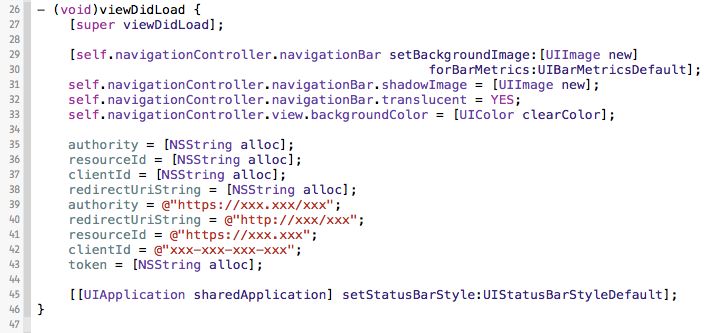
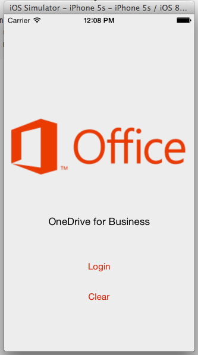
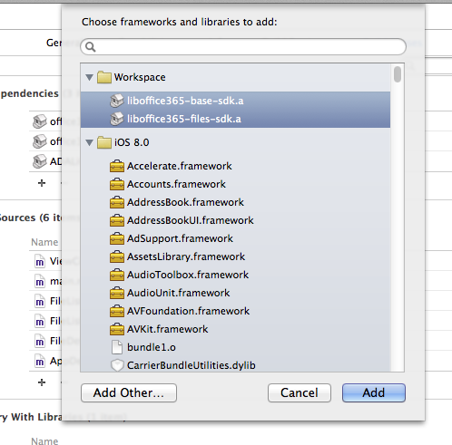
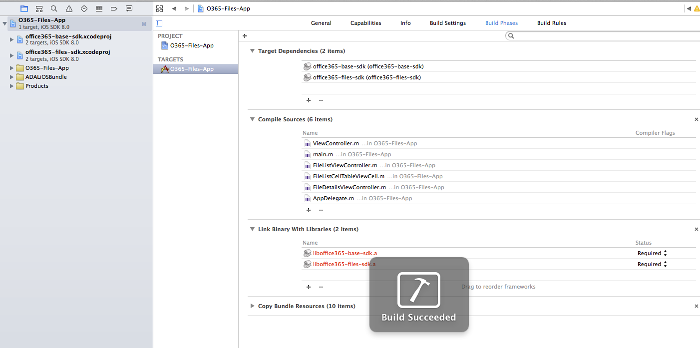
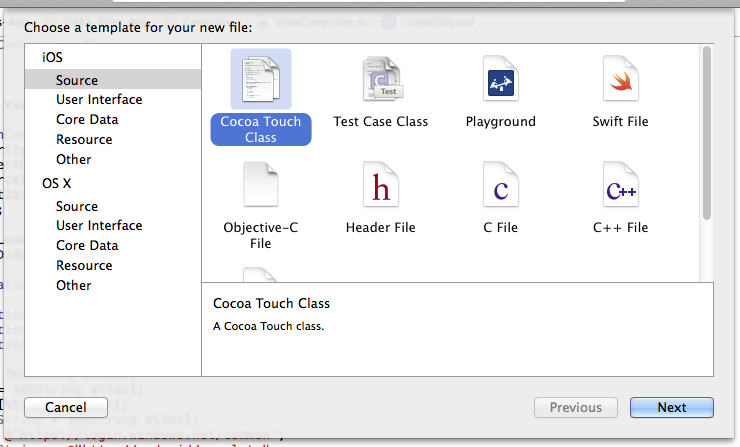
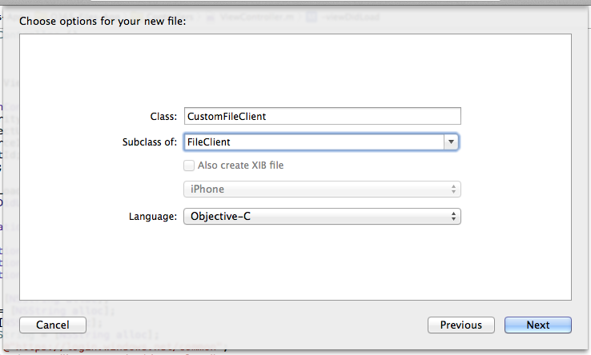
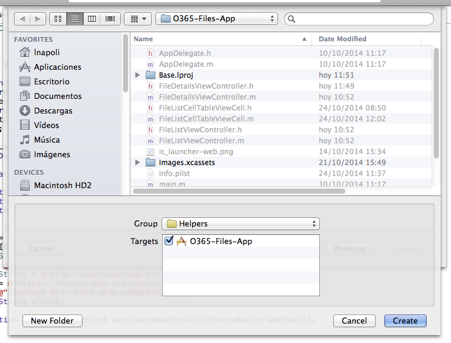
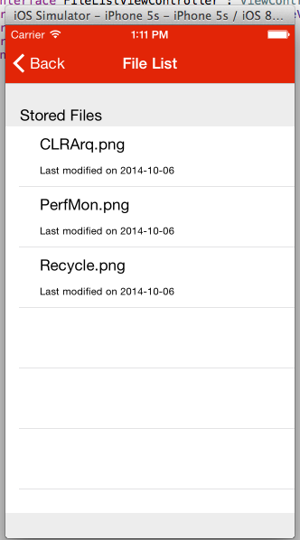
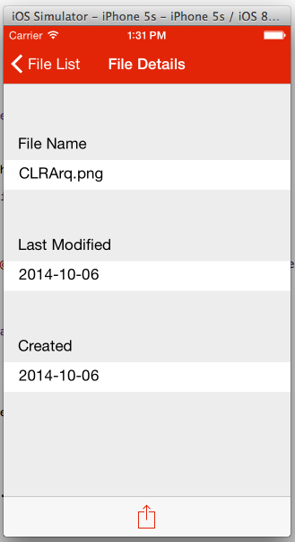
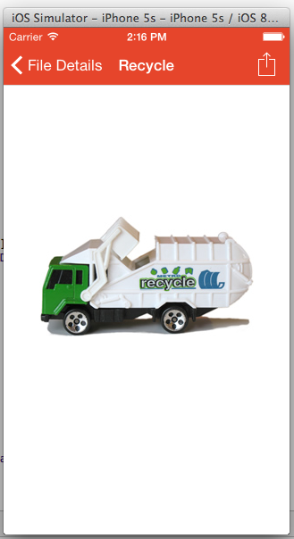

Module XX: *Manage Files in a O365 tenant with iOS*
==========================

##Overview

The lab lets students use an AzureAD account to manage files in a O365 Sharepoint tenant with an iOS app.

##Objectives

- Learn how to create a client for O365 to list files and download to the local storage to then show it in a preview page.

##Prerequisites

- Apple Macintosh environment
- XCode 6 (from the AppStore - compatible with iOS8 sdk)
- XCode developer tools (it will install git integration from XCode and the terminal)
- You must have a Windows Azure subscription to complete this lab.
- You must have completed Module 04 and linked your Azure subscription with your O365 tenant.
- You must have Cocoapods dependencies manager already installed on the Mac. (cocoapods.org)

##Exercises

The hands-on lab includes the following exercises:

- [Add O365 iOS files sdk library to the project](#exercise1)
- [Create a FileClient to get access to sharepoint](#exercise2)
- [Connect actions in the view to the Office365-Files-sdk](#exercise3)

<a name="exercise1"></a>
##Exercise 1: Add O365 iOS files sdk library to a project
In this exercise you will use an existing application with the AzureAD authentication included, to add the O365 files sdk library in the project
and create a client class with empty methods in it to handle the requests to the Sharepoint tenant.

###Task 1 - Open the Project
01. Clone this git repository in your machine

02. Open the **.xcworkspace** file in **src/O365-Files-App/**

03. Find and Open the **Auth.plist**

04. Fill the AzureAD account settings
    
    

03. Build and Run the project in an iOS Simulator to check the views

    ```
    Application:
    You will se a login page with buttons to access the application and to clear credentials.
    Once authenticated, a File list will appear with one fake entry. Also there is a File 
    Details screen (selecting a row in the table) with the name, last modified and created dates.
    Finally, there is an action button to download the File.

    Environment:
    To access the files, in the O365 Sharepoint tenant there is a Default space to store documents
    called "Shared Documents". We will use the o365-files-sdk to access these files, download them,
    and show a preview in the iOS application.
    ```

    

###Task 2 - Importing the library
01. On Finder, open the **Podfile** file under the root folder of the project and add the line:

    ```
    pod 'Office365/Files', '~>0.5.4'
    ```

02. Open a Terminal and navigate to the root folder of the project. Execute the following:

    ```
    pod install
    ```

03. Go to project settings selecting the first file from the files explorer. Then click on **Build Phases** section.

07. Under **Link Binary with Libraries** add an entry pointing to **office365-list-sdk.a** file

    

08. Build and Run the application to check everything is ok.

    

<a name="exercise2"></a>
##Exercise 2: Create a FileClient to get access to sharepoint

###Task 1 - Create a client class to connect to the o365-files-sdk

01. On the XCode files explorer, make a right click in the group **Helpers** and select **New File**. You will see the **New File wizard**. Click on the **iOS** section, select **Cocoa Touch Class** and click **Next**.

    

03. In this section, configure the new class giving it a name (**CustomFileClient**), and make it a subclass of **NSObject**. Make sure that the language dropdown is set with **Objective-C** because our o365-lists library is written in that programming language. Finally click on **Next**.

        

04. Now we are going to select where the new class sources files (.h and .m) will be stored. In this case we can click on **Create** directly. This will create a **.h** and **.m** files for our new class.

    

05. Open the **CustomFileClient.h** and add the header for the **getClient** method

    ```
    +(MSSharePointClient*)getClient:(NSString *) token;
    ```

    Add the import sentence
    ```
    #import <office365_drive_sdk/office365_drive_sdk.h>
    ```

06. In **CustomFileClient.m** add the method body:

    ```
    const NSString *apiUrl = @"/_api/files";

+(MSSharePointClient*)getClient:(NSString *) token{
    NSString *url = [NSString alloc];
    NSString* plistPath = [[NSBundle mainBundle] pathForResource:@"Auth" ofType:@"plist"];
    url = [[NSDictionary dictionaryWithContentsOfFile:plistPath] objectForKey:@"o365SharepointTenantUrl"];
    
    MSDefaultDependencyResolver* resolver = [MSDefaultDependencyResolver alloc];
    MSOAuthCredentials* credentials = [MSOAuthCredentials alloc];
    [credentials addToken: token];
    
    MSCredentialsImpl* credentialsImpl = [MSCredentialsImpl alloc];
    
    [credentialsImpl setCredentials:credentials];
    [resolver setCredentialsFactory:credentialsImpl];
    
    return [[MSSharePointClient alloc] initWitUrl:[url stringByAppendingString:@"/_api/v1.0/me"] dependencyResolver:resolver];
}
    ```

<a name="exercise3"></a>
##Exercise 3: Connect actions in the view to the Office365-Files-sdk
In this exercise you will navigate in every controller class of the project, in order to connect each action (from buttons, lists and events) with one Office365-Files-sdk command.

```
The Application has every event wired up with their respective controller classes. 
We need to connect this event methods to the o365-files-sdk.
```

###Task1 - Wiring up FileListView

01. Open **FileListViewController.h** class header and add a property to store the files.

    ```
    @property NSMutableArray *files;
    ```

    Also add an instance variable in the **FileListViewController.m** to hold the current selection
    ```
    MSSharePointItem* currentEntity;
    ```

    And the import sentence
    ```
    #import <office365_drive_sdk/office365_drive_sdk.h>
    ```


02. Open **FileListViewController.m** class implementation and the **loadData** method:

    ```
    -(void) loadData{
    //Create and add a spinner
    double x = ((self.navigationController.view.frame.size.width) - 20)/ 2;
    double y = ((self.navigationController.view.frame.size.height) - 150)/ 2;
    UIActivityIndicatorView* spinner = [[UIActivityIndicatorView alloc]initWithFrame:CGRectMake(x, y, 20, 20)];
    spinner.activityIndicatorViewStyle = UIActivityIndicatorViewStyleGray;
    [self.view addSubview:spinner];
    spinner.hidesWhenStopped = YES;
    [spinner startAnimating];
    
    MSSharePointClient *client = [CustomFileClient getClient:self.token];
    NSURLSessionDataTask *task = [[client getfiles]read:^(NSArray<MSSharePointItem> *files, NSError *error) {
        self.files = files;
        dispatch_async(dispatch_get_main_queue(), ^{
            [self.tableView reloadData];
            [spinner stopAnimating];
        });
    }];
    
    
    [task resume];
}
    ```
    Add the **loadCurrentFolder** method
    ```
    -(void) loadCurrentFolder{
    //Create and add a spinner
    double x = ((self.navigationController.view.frame.size.width) - 20)/ 2;
    double y = ((self.navigationController.view.frame.size.height) - 150)/ 2;
    UIActivityIndicatorView* spinner = [[UIActivityIndicatorView alloc]initWithFrame:CGRectMake(x, y, 20, 20)];
    spinner.activityIndicatorViewStyle = UIActivityIndicatorViewStyleGray;
    [self.view addSubview:spinner];
    spinner.hidesWhenStopped = YES;
    [spinner startAnimating];
    
    MSSharePointClient *client = [CustomFileClient getClient:self.token];
    
    [[[[[[client getfiles] getById:self.currentFolder.id] asFolder] getchildren] read:^(NSArray<MSSharePointItem> *files, NSError *error) {
        self.files = files;
        dispatch_async(dispatch_get_main_queue(), ^{
            [self.tableView reloadData];
            [spinner stopAnimating];
        });
    }] resume];
}
    ```

    Now call them from the **viewWillAppear** method. Also add the initialization for **currentEntity** and **files**
    ```
    - (void)viewWillAppear:(BOOL)animated{
    if (!self.currentFolder){
        self.navigationController.title = @"File List";
        [self loadData];
    }else{
        self.navigationController.title = self.currentFolder.name;
        [self loadCurrentFolder];
    }
    currentEntity = nil;
    }
    ```


03. Add the table methods:

    ```
    - (NSInteger)tableView:(UITableView *)tableView numberOfRowsInSection:(NSInteger)section{
        return self.files.count;
    }

    - (UITableViewCell *)tableView:(UITableView *)tableView cellForRowAtIndexPath:(NSIndexPath *)indexPath{
        NSString* identifier = @"fileListCell";
    FileListCellTableViewCell *cell =[tableView dequeueReusableCellWithIdentifier: identifier ];
    
    MSSharePointItem *file = [self.files objectAtIndex:indexPath.row];
    
    NSString *lastModifiedString = [formatter stringFromDate:file.dateTimeLastModified];
    
    cell.fileName.text = file.name;
    cell.lastModified.text = [NSString stringWithFormat:@"Last modified on %@", lastModifiedString];
    
    return cell;
    }

    - (void)tableView:(UITableView *)tableView didSelectRowAtIndexPath:(NSIndexPath *)indexPath{
        currentEntity= [self.files objectAtIndex:indexPath.row];
    
    if ([currentEntity.type isEqualToString:@"Folder"]){
        FileListViewController *controller = [[UIStoryboard storyboardWithName:@"Main" bundle:nil] instantiateViewControllerWithIdentifier:@"fileList"];
        controller.token = self.token;
        controller.currentFolder = currentEntity;
        
        [self.navigationController pushViewController:controller animated:YES];
    }else{
        [self performSegueWithIdentifier:@"detail" sender:self];
    }
    }
    ```

04. Add the navigation methods

    ```
    - (BOOL)shouldPerformSegueWithIdentifier:(NSString *)identifier sender:(id)sender{
        return ([identifier isEqualToString:@"detail"] && currentEntity);
    }

    -(void) prepareForSegue:(UIStoryboardSegue *)segue sender:(id)sender{
        if([segue.identifier isEqualToString:@"detail"]){
            FileDetailsViewController *ctrl = (FileDetailsViewController *)segue.destinationViewController;
            //ctrl.token = self.token;
            //ctrl.file = currentEntity;
        }
    }
    ```

05. Build and Run the application. Check everything is ok. Now you will be able to se the Files list from the O365 Sharepoint tenant and navigate the folders

    


###Task2 - Wiring up FilesDetailsView

01. On **FileListViewController.m**, uncomment the lines in the **prepareForSegue:identifier:** to allow passing the selected file to the next screen.

    ```
    //ctrl.token = self.token;
    //ctrl.file = currentEntity;
    ```

02. Open **FilesDetailsViewController.h** and add properties for the token, the selected file and the document handler

    ```
    @property NSString *token;
    @property MSSharePointItem *file;
    @property (nonatomic, strong) UIDocumentInteractionController *docInteractionController;
    ```

    Add the import sentence:
    ```
    #import "CustomFileClient.h"
    ```    

03. Open the **FilesDetailsViewController.m** class implementation and add the **loadFile** method

    ```
        - (void) loadFile{
    double x = ((self.navigationController.view.frame.size.width) - 20)/ 2;
    double y = ((self.navigationController.view.frame.size.height) - 150)/ 2;
    spinner = [[UIActivityIndicatorView alloc]initWithFrame:CGRectMake(x, y, 20, 20)];
    spinner.activityIndicatorViewStyle = UIActivityIndicatorViewStyleGray;
    [self.view addSubview:spinner];
    spinner.hidesWhenStopped = YES;
    [spinner startAnimating];
    
    NSString *fileUrlString = self.file.webUrl;
    
    MSSharePointClient *client = [CustomFileClient getClient:self.token];
    
    [[[[[client getfiles] getById:self.file.id] asFile] getContent:^(NSData *content, NSError *error){
        if ( content )
        {
            NSArray       *paths = NSSearchPathForDirectoriesInDomains(NSDocumentDirectory, NSUserDomainMask, YES);
            NSString  *documentsDirectory = [paths objectAtIndex:0];
            
            NSString  *filePath = [NSString stringWithFormat:@"%@/%@", documentsDirectory,self.file.name];
            [content writeToFile:filePath atomically:YES];
            
            NSURL *fileUrl = [NSURL fileURLWithPath:filePath];
            
            self.docInteractionController = [UIDocumentInteractionController interactionControllerWithURL:fileUrl];
            self.docInteractionController.delegate = self;
        }
        
        [spinner stopAnimating];
    }] resume];
}
    ```

    Also add the import sentence to the client class:
    ```
    #import "CustomFileClient.h"
    ```

    And an instance variable to hold the spinner:
    ```
    UIActivityIndicatorView* spinner;
    ```

04. Add the download button action and the documents handler methods

    ```
    - (UIViewController *) documentInteractionControllerViewControllerForPreview: (UIDocumentInteractionController *) controller
    {
        return [self navigationController];
    }


    - (IBAction)downloadAction:(id)sender {
        [self.docInteractionController presentPreviewAnimated:YES];
    }
    ```

    ```
    To handle the files, first we have to download and store it in the device local storage.
    Using the UIDocumentInteractionController we can access to this file url and show a preview
    of the file within the app. Also we have actions to open the file in other applications.
    ```

05. Now in the **viewDidLoad** method, add the labels value and call the **loadFile** method:

    ```
    self.fileName.text = self.file.Name;
    self.lastModified.text = [self.file.TimeLastModified substringToIndex:10];
    self.created.text = [self.file.TimeCreated substringToIndex:10];
      
    [self loadFile];
    ```

06. Build and Run the app, and check everything is ok. Now you can see the File details and when tapping the action button, you can see a preview of the document.

    File details                                                                        
    

    File preview                                                                      
    


##Summary

By completing this hands-on lab you have learnt:

01. The way to connect an iOS application with an Office365 tenant.

02. How to retrieve information from Sharepoint files.

03. How to download a Sharepoint file, store it in the local storage and preview inside the iOSApp.

