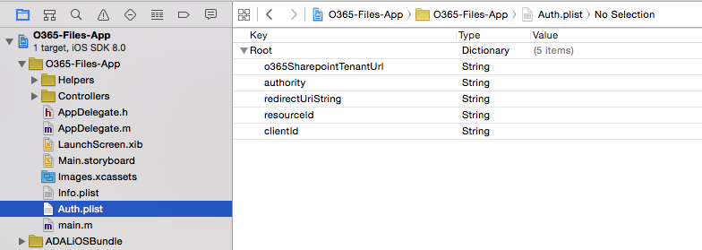
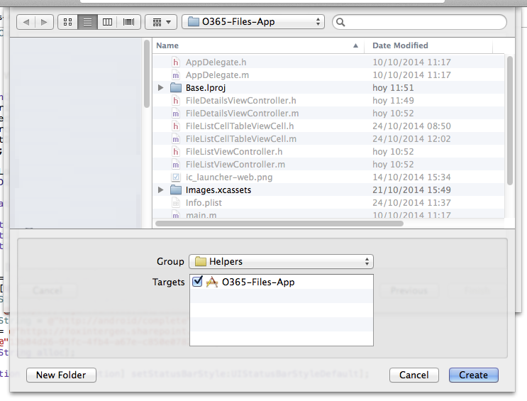

Module XX: *Manage Lists in a O365 tenant with iOS*
==========================

##Overview

The lab lets students use an AzureAD account to manage files in a O365 Sharepoint tenant with an iOS app.

##Objectives

- Learn how to create a client for O365 to list files and download to the local storage to then show it in a preview page.

##Prerequisites

- Apple Macintosh environment
- XCode 6 (from the AppStore - compatible with iOS8 sdk)
- XCode developer tools (it will install git integration from XCode and the terminal)
- You must have a Windows Azure subscription to complete this lab.
- You must have completed Module 04 and linked your Azure subscription with your O365 tenant.

##Exercises

The hands-on lab includes the following exercises:

- [Add O365 iOS files sdk library to the project](#exercise1)
- [Create a Client class for retrieve information and download files](#exercise2)
- [Connect actions in the view to CustomFileClient class](#exercise3)

<a name="exercise1"></a>
##Exercise 1: Add O365 iOS files sdk library to a project
In this exercise you will use an existing application with the AzureAD authentication included, to add the O365 files sdk library in the project
and create a client class with empty methods in it to handle the requests to the Sharepoint tenant.

###Task 1 - Open the Project
01. Download the starting point App:

    ```
    git clone 
    ```

02. Open the **.xcodeproj** file in the O365-Files-App

03. Find and Open the **ViewController.m** class under **O365-lists-app/controllers/login/**

04. Fill the AzureAD account settings in the **viewDidLoad** method
    
    

03. Build and Run the project in an iOS Simulator to check the views

    ```
    Application:
    You will se a login page with buttons to access the application and to clear credentials.
    Once authenticated, a File list will appear with one fake entry. Also there is a File 
    Details screen (selecting a row in the table) with the name, last modified and created dates.
    Finally, there is an action button to download the File.

    Environment:
    To access the files, in the O365 Sharepoint tenant there is a Default space to store documents
    called "Shared Documents". We will use the o365-files-sdk to access these files, download them,
    and show a preview in the iOS application.
    ```

    

###Task 2 - Importing the library
01. Download a copy of the library using the terminal:

    ```
    git clone 
    ```

02. Open the downloaded folder and copy **office365-files-sdk** folder under **Sdk-ObjectiveC**. Paste it in a lib folder inside our project path.

    

03. Drag the **office365-files-sdk.xcodeproj** file into XCode under our application project.
    
    

04. Repeat steps 02 and 03 with **office365-base-sdk**

05. Go to project settings selecting the first file from the files explorer. Then click on **Build Phases** and add an entry in the **Target Dependencies** section.

    

06. Select the **office365-files-sdk** and **office365-base-sdk** library dependencies.

    

07. Under **Link Binary with Libraries** add an entry pointing to **office365-base-sdk.a** and **office365-list-sdk.a** files

    

09. Now delete **ADALiOS.xcodeproj** from the project and select **Remove Reference** 
    
    ```
    This step avoids conflicts because office365-base-sdk already has ADALiOS 
    and is not necesary to have the library added twice
    ```    

    

08. Build and Run the application to check everything is ok.

    

<a name="exercise2"></a>
##Exercise 2: Create a Client class for retrieve information and download files
In this exercise you will create a client class for operations related to Files. This class will connect to the **office365-files-sdk**, and will be subclass of **FileClient**.

###Task 1 - Create a client class to connect to the o365-files-sdk

01. On the XCode files explorer, make a right click in the group **Helpers** and select **New File**. You will see the **New File wizard**. Click on the **iOS** section, select **Cocoa Touch Class** and click **Next**.

    

03. In this section, configure the new class giving it a name (**CustomFileClient**), and make it a subclass of **ListClient**. Make sure that the language dropdown is set with **Objective-C** because our o365-lists library is written in that programming language. Finally click on **Next**.

        

04. Now we are going to select where the new class sources files (.h and .m) will be stored. In this case we can click on **Create** directly. This will create a **.h** and **.m** files for our new class.

    

05. Build the Project and you will see one error. To fix it, change the import sentence On **CustomFileClient.h**.

    From :
    ```
    #import "FileClient.h"
    ```

    To:
    ```
    #import <office365-files-sdk/FileClient.h>
    ```

08. Re-build the project and check everything is ok.


###Task 2 - Add CustomFileClient methods

01. Open the **CustomFileClient.h** class and then add the following between **@interface** and **@end**

    ```
    - (NSURLSessionDataTask *)getFiles:(NSString *)folder callback :(void (^)(NSMutableArray *files, NSError *))callback;
    - (NSURLSessionDataTask *)download:(NSString *)fileName callback :(void (^)(NSData *data, NSError *error))callback;
    +(FileClient*)getClient:(NSString *) token;
    ```

02. Add the body of each method in the **CustomFileClient.m** file.

    Get Files
    ```
    const NSString *apiUrl = @"/_api/files";

- (NSURLSessionDataTask *)getFiles:(NSString *)folder callback :(void (^)(NSMutableArray *files, NSError *))callback{
    
    NSString *url;
    
    if(folder == nil){
        url = [NSString stringWithFormat:@"%@%@", self.Url , apiUrl];
    }
    else{
        url = [NSString stringWithFormat:@"%@%@", self.Url , apiUrl, [folder urlencode]];
    }
    
    HttpConnection *connection = [[HttpConnection alloc] initWithCredentials:self.Credential url:url];
    
    NSString *method = (NSString*)[[Constants alloc] init].Method_Get;
    
    return [connection execute:method callback:^(NSData  *data, NSURLResponse *reponse, NSError *error) {
        NSMutableArray *array = [NSMutableArray array];
        
        if(error == nil){
            array = [self parseData : data];
        }
        
        callback(array, error);
    }];
}
    ```

    Download File
    ```
- (NSURLSessionDataTask *)download:(NSString *)fileName callback :(void (^)(NSData *data, NSError *error))callback{
    
    NSString *url = [NSString stringWithFormat:@"%@%@('%@')/download", self.Url , apiUrl, [fileName stringByAddingPercentEscapesUsingEncoding:NSUTF8StringEncoding]];

    HttpConnection *connection = [[HttpConnection alloc] initWithCredentials:self.Credential url:url ];

    NSString *method = (NSString*)[[Constants alloc] init].Method_Get;

    return [connection execute:method callback:^(NSData  *data, NSURLResponse *reponse, NSError *error) {
        callback(data, error);
    }];
}
    ```

    
03. Add the **getClient** class method

    ```
    +(CustomFileClient*)getClient:(NSString *) token{
    OAuthentication* authentication = [OAuthentication alloc];
    [authentication setToken:token];
    
    return [[CustomFileClient alloc] initWithUrl:@"https://xxx.xxx/xxx"
                               credentials: authentication];
    }
    ```

    ```
    Make sure to change https://xxx.xxx/xxx with the Resource url in the 
    initWithUrl:credentials: method.
    ```

04. Add the following import sentences:

    ```
    #import "office365-base-sdk/NSString+NSStringExtensions.h"
    #import "office365-base-sdk/HttpConnection.h"
    #import "office365-base-sdk/Constants.h"
    #import "office365-base-sdk/OAuthentication.h"
    ```

05. Build the project and check everything is ok.


<a name="exercise3"></a>
##Exercise 3: Connect actions in the view to CustomFileClient class
In this exercise you will navigate in every controller class of the project, in order to connect each action (from buttons, lists and events) with one CustomFileClient operation.

```
The Application has every event wired up with their respective controller classes. 
We need to connect this event methods to our CustomFileClient class 
in order to have access to the o365-files-sdk.
```

###Task1 - Wiring up FileListView

01. Open **FileListViewController.h** class header and add a property to store the files.

    ```
    @property NSMutableArray *files;
    ```

    Also add an instance variable in the **FileListViewController.m** to hold the current selection
    ```
    FileEntity* currentEntity;
    ```


02. Open **FileListViewController.m** class implementation and the **loadData** method:

    ```
    -(void) loadData{
    //Create and add a spinner
    double x = ((self.navigationController.view.frame.size.width) - 20)/ 2;
    double y = ((self.navigationController.view.frame.size.height) - 150)/ 2;
    UIActivityIndicatorView* spinner = [[UIActivityIndicatorView alloc]initWithFrame:CGRectMake(x, y, 20, 20)];
    spinner.activityIndicatorViewStyle = UIActivityIndicatorViewStyleGray;
    [self.view addSubview:spinner];
    spinner.hidesWhenStopped = YES;
    [spinner startAnimating];
    
    CustomFileClient *client = [CustomFileClient getClient:self.token];
    NSURLSessionDataTask *task = [client getFiles:@"" callback:^(NSMutableArray *files, NSError *error) {
        self.files = files;
        dispatch_async(dispatch_get_main_queue(), ^{
            [self.tableView reloadData];
            [spinner stopAnimating];
        });
    }];
    [task resume];
}
    ```

    Now call it from the **viewWillAppear** method. Also add the initialization for **currentEntity** and **files**
    ```
    - (void)viewWillAppear:(BOOL)animated{
    currentEntity = nil;
    self.files = [[NSMutableArray alloc] init];
    [self loadData];
    }
    ```

03. Add the table methods:

    ```
    - (NSInteger)tableView:(UITableView *)tableView numberOfRowsInSection:(NSInteger)section{
        return self.files.count;
    }

    - (UITableViewCell *)tableView:(UITableView *)tableView cellForRowAtIndexPath:(NSIndexPath *)indexPath{
        NSString* identifier = @"fileListCell";
        FileListCellTableViewCell *cell =[tableView dequeueReusableCellWithIdentifier: identifier ];
        
        FileEntity *file = [self.files objectAtIndex:indexPath.row];
        
        cell.fileName.text = file.Name;
        cell.lastModified.text = [NSString stringWithFormat:@"Last modified on %@", [file.TimeLastModified substringToIndex:10]];
        
        return cell;
    }

    - (void)tableView:(UITableView *)tableView didSelectRowAtIndexPath:(NSIndexPath *)indexPath{
        currentEntity= [self.files objectAtIndex:indexPath.row];
        
        [self performSegueWithIdentifier:@"detail" sender:self];
    }
    ```

04. Add the navigation methods

    ```
    - (BOOL)shouldPerformSegueWithIdentifier:(NSString *)identifier sender:(id)sender{
        return ([identifier isEqualToString:@"detail"] && currentEntity);
    }

    -(void) prepareForSegue:(UIStoryboardSegue *)segue sender:(id)sender{
        if([segue.identifier isEqualToString:@"detail"]){
            FileDetailsViewController *ctrl = (FileDetailsViewController *)segue.destinationViewController;
            //ctrl.token = self.token;
            //ctrl.file = currentEntity;
        }
    }
    ```

05. Add the needed import sentences:

    ```
    #import "FileListCellTableViewCell.h"
    #import "office365-files-sdk/FileClient.h"
    #import "office365-base-sdk/OAuthentication.h"
    #import "office365-files-sdk/FileEntity.h"
    #import "CustomFileClient.h"
    #import "FileDetailsViewController.h"
    ```

06. Build and Run the application. Check everything is ok. Now you will be able to se the Files list from the O365 Sharepoint tenant

    


###Task2 - Wiring up FilesDetailsView

01. On **FileDetailsViewController.m**, uncomment the lines in the **prepareForSegue:identifier:** to allow passing the selected file to the next screen.

```
//ctrl.token = self.token;
//ctrl.file = currentEntity;
```

02. Open **FilesDetailsViewController.h** and add properties for the token, the selected file and the document handler

    ```
    @property NSString *token;
    @property FileEntity *file;
    @property (nonatomic, strong) UIDocumentInteractionController *docInteractionController;
    ```

    Add the import sentence:
    ```
    #import "office365-files-sdk/FileEntity.h"
    ```    

03. Open the **FilesDetailsViewController.m** class implementation and add the **loadFile** method

```
    - (void) loadFile{
    double x = ((self.navigationController.view.frame.size.width) - 20)/ 2;
    double y = ((self.navigationController.view.frame.size.height) - 150)/ 2;
    spinner = [[UIActivityIndicatorView alloc]initWithFrame:CGRectMake(x, y, 20, 20)];
    spinner.activityIndicatorViewStyle = UIActivityIndicatorViewStyleGray;
    [self.view addSubview:spinner];
    spinner.hidesWhenStopped = YES;
    [spinner startAnimating];
    
    NSString *fileUrlString = self.file.Url;
    
    CustomFileClient *client = [CustomFileClient getClient:self.token];
    
    NSURLSessionDataTask *task = [client download:self.file.Name callback:^(NSData *data, NSError *error) {
        if ( data )
        {
            NSArray       *paths = NSSearchPathForDirectoriesInDomains(NSDocumentDirectory, NSUserDomainMask, YES);
            NSString  *documentsDirectory = [paths objectAtIndex:0];
            
            NSString  *filePath = [NSString stringWithFormat:@"%@/%@", documentsDirectory,self.file.Name];
            [data writeToFile:filePath atomically:YES];
            
            NSURL *fileUrl = [NSURL fileURLWithPath:filePath];
            
            self.docInteractionController = [UIDocumentInteractionController interactionControllerWithURL:fileUrl];
            self.docInteractionController.delegate = self;
        }
        dispatch_async(dispatch_get_main_queue(), ^{
            [spinner stopAnimating];
        });
    }];
    
    [task resume];
}
```

Also add the import sentence to the client class:
```
#import "CustomFileClient.h"
```

And an instance variable to hold the spinner:
```
UIActivityIndicatorView* spinner;
```

04. Add the download button action and the documents handler methods

```
- (UIViewController *) documentInteractionControllerViewControllerForPreview: (UIDocumentInteractionController *) controller
{
    return [self navigationController];
}


- (IBAction)downloadAction:(id)sender {
    [self.docInteractionController presentPreviewAnimated:YES];
}
```

```
To handle the files, first we have to download and store it in the device local storage.
Using the UIDocumentInteractionController we can access to this file url and show a preview
of the file within the app. Also we have actions to open the file in other applications.
```

05. Now in the **viewDidLoad** method, add the labels value and call the **loadFile** method:

```
self.fileName.text = self.file.Name;
self.lastModified.text = [self.file.TimeLastModified substringToIndex:10];
self.created.text = [self.file.TimeCreated substringToIndex:10];
  
[self loadFile];
```

06. Build and Run the app, and check everything is ok. Now you can see the File details and when tapping the action button, you can see a preview of the document.

    File details
    

    File preview                                                                      
    


##Summary

By completing this hands-on lab you have learnt:

01. The way to connect an iOS application with an Office365 tenant.

02. How to retrieve information from Sharepoint files.

03. How to download a Sharepoint file, store it in the local storage and preview inside the iOSApp.

